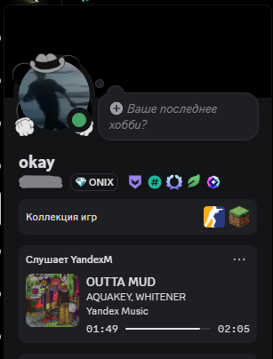

<div align="center">

# Yandex Music Discord RPC

Показывает текущий трек из Яндекс Музыки в Discord Rich Presence на Windows.

[](https://github.com/ownersmc/YandexMusicDiscordRPC/releases)
[](https://github.com/ownersmc/YandexMusicDiscordRPC/releases)
[](https://github.com/ownersmc/YandexMusicDiscordRPC/releases)
[](https://www.python.org/)
[](LICENSE)



</div>

## О проекте

Yandex Music Discord RPC - небольшой Windows-клиент, который берет данные о текущем треке из системной медиасессии Windows и отправляет их в Discord Rich Presence.

Проект не требует входа в аккаунт Яндекса и не использует токен Яндекс Музыки. Он работает локально: если Windows видит текущий трек в панели управления медиа, приложение сможет показать его в Discord.

## Что показывает

- название трека;
- исполнителя;
- обложку трека;
- таймер позиции трека в реальном времени;
- состояние паузы и время паузы;
- кнопку со ссылкой на текущий трек в Яндекс Музыке;
- запасное удержание активности, если Яндекс Музыка долго грузит следующий трек.

## Быстрый старт

Для обычного запуска Python не нужен.

1. Скачайте `YandexMusicDiscordRPC-portable.zip` из [Releases](https://github.com/ownersmc/YandexMusicDiscordRPC/releases).
2. Распакуйте архив в любую папку.
3. Откройте Discord.
4. Откройте Яндекс Музыку и включите трек.
5. Запустите `YandexMusicDiscordRPC.exe`.

Окно программы нужно оставить открытым, пока нужна активность в Discord. При первом запуске рядом с exe появится `config.json`; обычно его можно не трогать.

## Требования

- Windows 10 или Windows 11;
- установленный Discord Desktop;
- включенная активность в Discord: `Settings -> Activity Privacy -> Share your detected activities with others`;
- Яндекс Музыка в приложении или браузере, который отдает трек в Windows media controls.

## Как это работает

Приложение читает текущую Windows media session через WinRT. Оттуда берутся название, исполнитель, альбом, длительность, позиция и статус воспроизведения.

Для красивого Rich Presence используются:

- `LISTENING` activity type;
- `start` и `end` timestamps, чтобы Discord сам вел таймер;
- поиск публичной HTTPS-обложки через Яндекс Музыку;
- ссылка на найденный трек;
- отслеживание перемотки, чтобы таймер не начинался с `0:00`, если RPC включили посреди трека.

## Возможности

| Возможность | Статус |
| --- | --- |
| Название и исполнитель | Готово |
| Обложка трека | Готово |
| Таймер текущей позиции | Готово |
| Перемотка трека | Готово |
| Пауза с отдельным статусом | Готово |
| Кнопка на текущий трек | Готово |
| Portable exe | Готово |
| GitHub Actions сборка | Готово |

## Ограничения

Discord Rich Presence не дает обычным клиентам рисовать полностью кастомную полоску прогресса как в самом плеере Яндекс Музыки. Поэтому приложение передает `start/end` timestamps, а Discord отображает доступный ему таймер и прогресс.

Если обложка не отображается у других людей, значит Discord не смог получить картинку по публичному HTTPS URL. В таком случае можно указать запасную картинку или публичный адрес для локального сервера обложек в `config.json`.

## Настройка

Пример настроек лежит в [config.example.json](config.example.json).

Основные параметры:

```json
{
  "discord_client_id": "1502442948527128617",
  "activity_type": "listening",
  "timestamp_mode": "both",
  "seek_update_threshold_seconds": 3,
  "loading_grace_seconds": 45,
  "track_button": {
    "enabled": true,
    "label": "Открыть трек"
  }
}
```

Полезные поля:

- `source_filters` - по каким словам искать медиасессию Яндекс Музыки;
- `show_when_paused` - показывать ли активность на паузе;
- `timestamp_mode` - как передавать таймер в Discord;
- `seek_update_threshold_seconds` - насколько сильно должна измениться позиция, чтобы считать это перемоткой;
- `loading_grace_seconds` - сколько секунд держать прошлую активность при загрузке нового трека;
- `progress_bar` - текстовая имитация полоски, если нужна строка в `state`;
- `cover_art` - настройки обложек;
- `track_button` - кнопка со ссылкой на текущий трек.

## Запуск из исходников

Если хотите запускать проект как Python-скрипт:

```bat
run.bat
```

Скрипт сам создаст `.venv`, установит зависимости и запустит клиент.

Вручную:

```bat
py -m venv .venv
.\.venv\Scripts\python.exe -m pip install -r requirements.txt
.\.venv\Scripts\python.exe yd_discord_presence.py
```

## Сборка exe

Для локальной сборки portable-версии:

```bat
build_release.bat
```

После сборки появятся:

- `release/YandexMusicDiscordRPC.exe`;
- `release/README_START.txt`;
- `YandexMusicDiscordRPC-portable.zip`.

Также есть workflow [Build Windows exe](.github/workflows/build-windows.yml), который собирает portable-архив через GitHub Actions вручную или при push тега `v*`.

## Если Discord ничего не показывает

1. Проверьте, что Discord открыт до запуска RPC.
2. Включите показ активности в настройках Discord.
3. Запустите трек в Яндекс Музыке и подождите несколько секунд.
4. Если используется браузер, попробуйте поставить `"source_filters": []` в `config.json`.
5. Если Windows не показывает трек в медиа-оверлее, RPC тоже не сможет его прочитать.

## Для разработчиков

Проект написан на Python и использует:

- [pypresence](https://github.com/qwertyquerty/pypresence) для Discord RPC;
- [winrt](https://pypi.org/project/winrt-Windows.Media.Control/) для Windows media sessions;
- [PyInstaller](https://pyinstaller.org/) для portable exe.

Pull requests и Issues приветствуются.

## Лицензия

Проект распространяется под лицензией [MIT](LICENSE).
